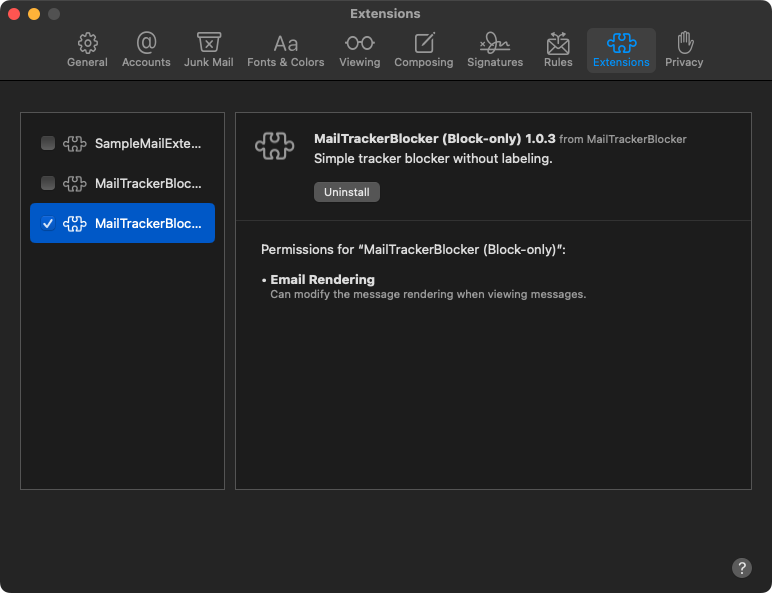

    

**MailTrackerBlocker** is an email tracker blocker for macOS Mail. Email marketers and other interests often embed invisible trackers in HTML emails so [they can track how often, when and where you open your emails](https://notospypixels.com/). Enable the included Mail extension to find out who is tracking you and to block these spy pixels in your emails.

> [!WARNING]
> Users have reported that [[FB12796974] emails take a long time to load](https://github.com/apparition47/MailTrackerBlockerApp/issues/2). Apple has acknowledged this Mail bug and will release a fix in a future update of macOS.

#### Available in the Mac App Store

#### Free Demo

Try out the beta for free by [enrolling on TestFlight](https://testflight.apple.com/join/cQLJpecQ)!

## Features

- Mail extension.

- Privacy protection: Blocks most spy pixels which may capture your IP address and function as read receipts and more.

- Be informed: Identifies nearly 300 of the most common email marketing vendors.

- Tracker report: See a 30-day overview of blocked trackers in your emails.
  

## Requirements

- macOS Sonoma 14.3 or newer
- Apple Mail

## Usage

### How to enable the Mail extension

1. Open the Mail app.
2. Go to Settings > Extensions.
3. Check `MailTrackerBlocker` to enable it. If you have multiple message security extensions installed, set "Message security extension" to `MailTrackerBlocker` to ensure trackers are blocked. Note that only one message security extension can be active.
4. [Recommended] Images are safe for viewing now so to re-enable them: Goto Mail > Settings > Privacy > disable "Block All Remote Content".
5. You should now see a 🧩 jigsaw puzzle icon over the message pane header as you read your emails. The extension is now enabled!

#### Tracking Report

Open the MailTrackerBlocker app or tap the 🧩 jigsaw puzzle icon in Mail that appears over the message pane header. The Tracking Report shows a rolling 30-day overview of e-mails grouped by tracker along with some frequency statistics.

## FAQ

### Sometimes extension not running/puzzle icon missing even when enabled

See [`FB13801609`](https://github.com/apparition47/MailTrackerBlockerApp/issues/9) for workarounds.

### Does this work with Mail Privacy Protection?

Yes, even in network environments (e.g. VPN) where Mail Privacy Protection doesn't work, MailTrackerBlocker will still block and identify trackers if you choose to "Load Remote Content".

Note: [Mail Privacy Protection's proxy will still fetch the tracker image, triggering the tracker after an unknown period of time](https://www.mailbutler.io/blog/news/why-apples-mail-privacy-protection-does-not-break-mailbutlers-tracking-feature/). In the period of time before this happens, if you open your email without MailTrackerBlocker, the proxy will fetch the tracking image and trigger the tracker at that moment still letting the tracker know your exact opening time.

## Contact

MailTrackerBlocker is developed by [Aaron Lee](https://x.com/apparition47) and published under One Fat Giraffe.
