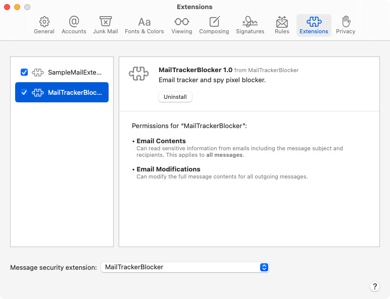

    

**MailTrackerBlocker** is a tracker blocker for Mail. Email marketers and other interests often embed invisible trackers in HTML emails so they can track how often, when and where you open your emails. Enable the included Mail extension to block spy pixels from your emails.

#### Available in the Mac App Store

## Features

- Mail extension.
- Privacy protection: Blocks most spy pixels which may capture your IP address and function as read receipts and more.
  

## Requirements

- macOS Ventura 13 or newer
- Apple Mail

## Usage

### How to enable the tracker

1. Open the Mail app.
2. Goto Mail > Settings > Extensions.
3. Check `MailTrackerBlocker` to enable it. If you have multiple message security extensions installed, set "Message security extension" to `MailTrackerBlocker` to ensure trackers are blocked.

Enabling Mail > Privacy > "Block All Remote Content" with MailTrackerBlocker enabled is redundant; disable "Block All Remote Content" for the best experience.

### Tracking Report

Open the MailTrackerBlocker app or tap the 🧩 puzzle icon in Mail that appears over the message pane header (note: the 🧩 puzzle icon is hidden if the selected e-mail has an attachment). The Tracking Report shows a rolling 30-day overview of e-mails grouped by tracker along with some frequency statistics.

The Tracking Report does not work with the `MailTrackerBlocker (Block-only` extension.

## Crashes, slow attachment email loading issues

⚠️ If you're experiencing **crashes or slow attachment email loading**, please enable the `MailTrackerBlocker (Block-only)` extension and disable the `MailTrackerBlocker` extension. I've filed these two issues with Apple (FB12794488, FB12796974) because these will need to be addressed by them (in the form of a macOS update, most likely). I recommend filing your own issues at https://feedbackassistant.apple.com to bring more visibility to these bugs.

## FAQ

### Does this work with Mail Privacy Protection?

Yes, even in network environments (e.g. VPN) where Mail Privacy Protection doesn't work, MailTrackerBlocker will still block and identify trackers if you choose to "Load Remote Content".

## Contact

Feel free to send me a message @apparition47 on [Twitter](https://www.twitter.com/apparition47) or [GitHub](https://www.github.com/apparition47).
