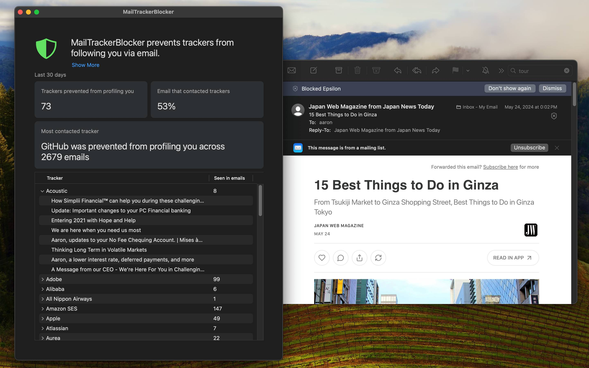

    

**MailTrackerBlocker** is an email tracker blocker for macOS Mail. Email marketers and other interests often embed invisible trackers in HTML emails so [they can track how often, when and where you open your emails](https://notospypixels.com/). Enable the included Mail Extension to find out who is tracking you and to block these spy pixels in your emails.

> [!WARNING]
> Users have reported that [[FB12796974] emails take a long time to load](https://github.com/apparition47/MailTrackerBlockerApp/issues/2). Apple has acknowledged this Mail bug and will release a fix in a future update of macOS.

#### Available in the Mac App Store

#### Free Demo

Try out the beta for free by [enrolling on TestFlight](https://testflight.apple.com/join/cQLJpecQ)!

## Features

- Mail Extension: built specifically for macOS Sonoma and Apple Mail.

- Privacy protection: Blocks most spy pixels which may capture your IP address and function as read receipts and more.

- Be informed: Identifies [over 300 of the most common email marketing vendors](https://github.com/apparition47/MailTrackerBlocker/blob/main/Source/MTBBlockedMessage.m#L212-L773).

- Tracker report: See a 30-day overview of blocked trackers in read emails along with some summary statistics.
  

## Requirements

- macOS Sonoma 14.3 or newer
- Apple Mail
  - Note: Mail only allows up to one active `Message Security Extension` at a time. Set MailTrackerBlocker as your active Message Security Extension to unlock tracker reporting and unknown tracker blocking features.

## Usage

### How to enable the Mail Extension

1. Open the Mail app.
1. From the menu bar, open Settings > Extensions.
1. Check `MailTrackerBlocker` to enable it.
    * Mail allows only one active Message Security Extension at a time. If you have multiple installed, [select `MailTrackerBlocker` from the "Message security extension:" dropdown at the bottom](https://github.com/apparition47/MailTrackerBlockerApp/assets/3298414/26238241-fad6-42db-8141-17558aef8826) to enable tracker reporting and to block unknown trackers. These features won't be available if your Message security extension is set otherwise.
1. [Optional] Images are safe for viewing now so to re-enable them: Goto Mail > Settings > Privacy > disable "Block All Remote Content".

### How to view tracking reports

#### Message Labeler

In Mail, when selecting an email, a banner above the message panel if a tracker was detected. Or click the small ⓧ icon to view what trackers MailTrackerBlocker has detected.

#### Tracking Report

Open the MailTrackerBlocker app. The Tracking Report shows a rolling 30-day overview of e-mails grouped by tracker along with statistics.

## FAQ

### Sometimes ⓧ icon missing even when enabled

See [`FB13801609`](https://github.com/apparition47/MailTrackerBlockerApp/issues/9) for workarounds.

### Does this work with Mail Privacy Protection?

Yes, even in network environments (e.g. VPN) where Mail Privacy Protection doesn't work, MailTrackerBlocker will still block and identify trackers if you choose to "Load Remote Content".

Note: [Mail Privacy Protection's proxy will still fetch the tracker image, triggering the tracker after an unknown period of time](https://www.mailbutler.io/blog/news/why-apples-mail-privacy-protection-does-not-break-mailbutlers-tracking-feature/). In the period of time before this happens, if you open your email without MailTrackerBlocker, the proxy will fetch the tracking image and trigger the tracker at that moment still letting the tracker know your exact opening time.

## Contact

MailTrackerBlocker is developed by [Aaron Lee](https://x.com/apparition47) and published under One Fat Giraffe.
